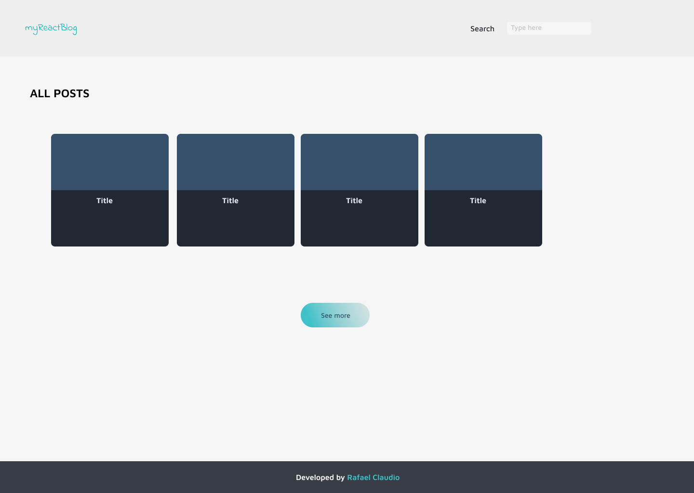

<h1>My React Blog✨</h1>
<strong>🚩Warning!!! (In develoment)</strong>

This is a project developed using react basic tools learned to pratice and get more experience using this library

My goals building this project are improve my javascript and react skills, cause the only way to get better is praticing

<h4>My Project Design Idea</h4>

<h6>Dependencies to this project</h6>

React 18 using create react app tool

Axios to get the resolved json from JsonPlaceHolder API
